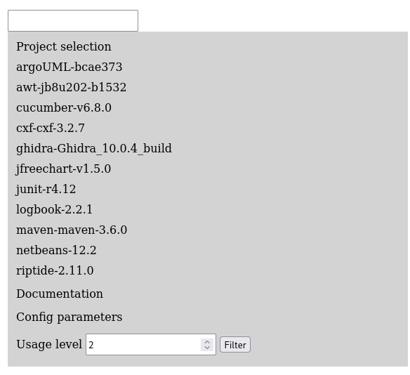

# Installation instructions

In this document, we assume that you already have system with:
- a fully functional Docker and Docker Compose install;
- a web browser.

See REQUIREMENTS.md file for more details.

## Running VariCity

All the scripts below are located and executed from the `varicity` directory, located at the root of the project.

*Note:* Before running VariCity, you need to have visualizations files generated in the `generated_visualizations` directory at the root of the project.
These visualizations are obtained by first executing symfinder (see [Running symfinder](#running_symfinder)), or by unpacking pre-generated visualizations present in the`pre_generated_visualizations.zip` archive at the root of the project. 

### Reusing the existing Docker image

VariCity is available as a Docker image hosted on the [Docker Hub](https://hub.docker.com/r/deathstar3/varicity),
allowing to use it without needing to build it.

Run VariCity by running


- On GNU/Linux and macOS

    ```bash
    ./varicity.sh
    ```

- On Windows

    ```batch
    varicity.bat
    ```

*Note:* Docker automatically downloads the image with the `vissoft2021` tag if it is not found on the host system.

You can also download it manually with:
```
docker pull deathstar3/varicity:vissoft2021
```

VariCity is a NodeJS application written in TypeScript deployed in a webpack environment.
The Docker container exposes the application as a server, which is accessed through your web browser.

### Building VariCity

**This step is only needed if you edited VariCity's source code.**

You can build VariCity's Docker images by running

```bash
./build.sh
```

Then, run symfinder using the local images that you just built.

```bash
./varicity.sh --local
```

*Note:* Due to end of lines problems on Windows, building the Docker images is only possible if you use a GNU/Linux or macOS system.

### Checking that VariCity works

- The script indicates that the `vissoft2021` image is used.
- The Docker container starts, and runs the `webpack serve` command, which compiles the sources and exposes the project on `localhost:9090`.
```
$ ./varicity.sh
Using vissoft2021 VariCity image
Creating network "varicity_default" with the default driver
Creating varicity ... done
Attaching to varicity
varicity         | 
varicity         | > varicity@1.0.0 start /usr/src/app
varicity         | > webpack serve
varicity         | 
varicity         | ℹ ｢wds｣: Project is running at http://0.0.0.0:9090/
varicity         | ℹ ｢wds｣: webpack output is served from /
varicity         | ℹ ｢wds｣: Content not from webpack is served from /usr/src/app/public
```
- After some seconds (depending on your machine) of compilation, a message indicates that the code compiled successfully.
```
varicity         | webpack 5.9.0 compiled successfully in 16679 ms
varicity         | ℹ ｢wdm｣: Compiled successfully.
```
- You can now open your web browser and go to `http://localhost:9090`.
- On the right panel, click on `Project selection`. The list of the available projects appear.
  
- By clicking on the desired project's name, the visualization appears on the left, here JFreeChart.
  


## Running symfinder

Reproducing the pre-generated visualizations is done by executing symfinder before VariCity.

### Reusing the existing Docker images

The following Docker images hosted on the [Docker Hub](https://hub.docker.com/) allow to use symfinder without needing to build it.
```bash
deathstar3/symfinder-fetcher
deathstar3/symfinder-neo4j
deathstar3/symfinder-engine
deathstar3/symfinder-runner
```

Run the analyses by running


- On GNU/Linux and macOS

    ```bash
    ./run.sh
    ```

- On Windows

    ```batch
    run.bat
    ```

This command will analyse the following projects:
- [Java AWT 8u202-b1532](https://github.com/JetBrains/jdk8u_jdk/tree/jb8u202-b1532/src/share/classes/java/awt)
- [Apache CXF 3.2.7](https://github.com/apache/cxf/tree/cxf-3.2.7/core/src/main/java/org/apache/cxf)
- [JUnit 4.12](https://github.com/junit-team/junit4/tree/r4.12/src/main/java)
- [Apache Maven 3.6.0](https://github.com/apache/maven/tree/maven-3.6.0)
- [JFreeChart 1.5.0](https://github.com/jfree/jfreechart/tree/v1.5.0/src/main/java/org/jfree)
- [ArgoUML](https://github.com/marcusvnac/argouml-spl/tree/bcae37308b13b7ee62da0867a77d21a0141a0f18/src)
- [Cucumber v6.8.0](https://github.com/cucumber/cucumber-jvm/tree/v6.8.0)
- [Logbook 2.2.1](https://github.com/zalando/logbook/tree/2.2.1)
- [Riptide 2.11.0](https://github.com/zalando/riptide/tree/2.11.0)
- [NetBeans 12.2](https://github.com/apache/netbeans/tree/12.2/java)

Running symfinder on all projects can take multiple hours.
You can therefore specify the projects you want to run by passing their names as parameters of the running script, for example

```bash
./run.sh jfreechart
```

More details about the analysed projects and their definition are given in the "Using symfinder on your project" section in the README present in the artifact's root directory.

*Note:* The Docker images are automatically downloaded by Docker with the tag `vissoft2021` if they are not found on the host system.
If an image is not found, you can download it manually with the `docker pull` command

Example:
```bash
docker pull deathstar3/symfinder-fetcher:vissoft2021
```

### Building symfinder

**This step is only needed if you edited symfinder's source code.**

You can build symfinder's Docker images by running

```bash
./build.sh
```

Then, run symfinder using the local images that you just built.

```bash
./run.sh --local
```

### Checking that symfinder works
Hereafter, we illustrate the different steps of the execution of symfinder by giving excerpts of console outputs corresponding to the execution of symfinder on a single project, JFreeChart.

1. First, symfinder creates the directories containing the analysed project(s) sources and generated visualization files,
and clones the directory of the analysed project(s), checking out the desired tags/commits.
```
$ ./run.sh jfreechart
resources directory already exists
generated_visualizations directory already exists
Using vissoft2021 images
Cloning into 'resources/jfreechart'...
Note: switching to 'tags/v1.5.0'.

You are in 'detached HEAD' state. You can look around, make experimental
changes and commit them, and you can discard any commits you make in this
state without impacting any branches by switching back to a branch.

If you want to create a new branch to retain commits you create, you may
do so (now or later) by using -c with the switch command. Example:

  git switch -c <new-branch-name>

Or undo this operation with:

  git switch -

Turn off this advice by setting config variable advice.detachedHead to false

HEAD is now at fd72df7c Prepare for 1.5.0 release.
HEAD is now at fd72df7c Prepare for 1.5.0 release.
```
2. Then, the `symfinder-runner` container starts, and creates two other Docker containers:
  - `symfinder-neo4j`, a Neo4j database used to store information about the analysed project (classes, methods, identified variation points and variants…)
  - `symfinder`, being the symfinder engine which parses the codebase of the project and populates the Neo4j database.
```
Creating network "varicity-develop_default" with the default driver
Creating symfinder-runner ... done
Attaching to symfinder-runner
symfinder-runner | Cleaning previous execution...
symfinder-runner | Removing network default_default
symfinder-runner | Network default_default not found.
symfinder-runner | Creating network "default_default" with the default driver
symfinder-runner | Creating symfinder-neo4j ... 
symfinder-runner | Creating symfinder-neo4j ... done
symfinder-runner | Creating symfinder       ... 
symfinder-runner | Creating symfinder       ... done
symfinder-runner | Attaching to symfinder-neo4j, symfinder
symfinder-runner | symfinder-neo4j | Changed password for user 'neo4j'.
symfinder-runner | symfinder    | WARNING: sun.reflect.Reflection.getCallerClass is not supported. This will impact performance.
symfinder-runner | symfinder    | Jul 30, 2021 9:16:05 AM org.neo4j.driver.internal.logging.JULogger info
symfinder-runner | symfinder    | INFO: Direct driver instance 1489933928 created for server address neo4j:7687
symfinder-runner | symfinder    | 09:16:05.503 [main] MY_LEVEL Symfinder - Symfinder version: 84ef141e60a9414c842e35abdfb5303dc9a204cf
symfinder-runner | symfinder-neo4j | Directories in use:
symfinder-runner | symfinder-neo4j |   home:         /var/lib/neo4j
symfinder-runner | symfinder-neo4j |   config:       /var/lib/neo4j/conf
symfinder-runner | symfinder-neo4j |   logs:         /logs
symfinder-runner | symfinder-neo4j |   plugins:      /plugins
symfinder-runner | symfinder-neo4j |   import:       /var/lib/neo4j/import
symfinder-runner | symfinder-neo4j |   data:         /var/lib/neo4j/data
symfinder-runner | symfinder-neo4j |   certificates: /var/lib/neo4j/certificates
symfinder-runner | symfinder-neo4j |   run:          /var/lib/neo4j/run
symfinder-runner | symfinder-neo4j | Starting Neo4j.
symfinder-runner | symfinder    | Waiting for Neo4j database to be ready...
symfinder-runner | symfinder-neo4j | 2021-07-30 09:16:06.028+0000 INFO  ======== Neo4j 4.0.3 ========
symfinder-runner | symfinder-neo4j | 2021-07-30 09:16:06.033+0000 INFO  Starting...
symfinder-runner | symfinder    | Waiting for Neo4j database to be ready...
symfinder-runner | symfinder-neo4j | 2021-07-30 09:16:13.356+0000 INFO  Called db.clearQueryCaches(): Query cache already empty.
symfinder-runner | symfinder-neo4j | 2021-07-30 09:16:13.404+0000 INFO  Bolt enabled on 0.0.0.0:7687.
symfinder-runner | symfinder-neo4j | 2021-07-30 09:16:13.405+0000 INFO  Started.
symfinder-runner | symfinder-neo4j | 2021-07-30 09:16:13.972+0000 INFO  Remote interface available at http://0.0.0.0:7474/
symfinder-runner | symfinder    | 09:16:15.780 [main] MY_LEVEL Symfinder - ClassesVisitor
symfinder-runner | symfinder    | 09:16:16.300 [main] INFO  visitors.SymfinderVisitor - Visitor: visitors.ClassesVisitor - Class: org.jfree.chart.ui.StrokeChooserPanel
symfinder-runner | symfinder    | 09:16:17.045 [main] INFO  visitors.SymfinderVisitor - Visitor: visitors.ClassesVisitor - Class: org.jfree.chart.ui.ApplicationFrame
symfinder-runner | symfinder    | 09:16:17.228 [main] INFO  visitors.SymfinderVisitor - Visitor: visitors.ClassesVisitor - Class: org.jfree.chart.ui.FontChooserPanel
symfinder-runner | symfinder    | 09:16:17.346 [main] INFO  visitors.SymfinderVisitor - Visitor: visitors.ClassesVisitor - Class: org.jfree.chart.ui.PaintSample
symfinder-runner | symfinder    | 09:16:17.438 [main] INFO  visitors.SymfinderVisitor - Visitor: visitors.ClassesVisitor - Class: org.jfree.chart.ui.GradientPaintTransformType
symfinder-runner | symfinder    | 09:16:17.532 [main] INFO  visitors.SymfinderVisitor - Visitor: visitors.ClassesVisitor - Class: org.jfree.chart.ui.StrokeSample
```
Five visitors are run on the codebase: `ClassesVisitor`, `GraphBuilderVisitor`, `StrategyTemplateDecoratorVisitor`, `FactoryVisitor`, and `ComposeTypeVisitor`.

3. At the end of the successive parsings, a summary of the results of the execution is given, and the `symfinder-runner` stops the `symfinder-neo4j` and `symfinder` containers.
If multiple projects are analysed, step 2. is executed for each project.
```
symfinder-runner | symfinder    | 09:21:19.953 [main] INFO  visitors.SymfinderVisitor - Visitor: visitors.ComposeTypeVisitor - Class: org.jfree.data.KeyedObjects2D
symfinder-runner | symfinder    | 09:21:20.224 [main] INFO  visitors.SymfinderVisitor - Visitor: visitors.ComposeTypeVisitor - Class: org.jfree.data.category.IntervalCategoryDataset
symfinder-runner | symfinder    | 09:21:20.299 [main] INFO  visitors.SymfinderVisitor - Visitor: visitors.ComposeTypeVisitor - Class: org.jfree.data.category.DefaultCategoryDataset
symfinder-runner | symfinder    | 09:21:20.642 [main] INFO  visitors.SymfinderVisitor - Visitor: visitors.ComposeTypeVisitor - Class: org.jfree.data.category.SlidingCategoryDataset
symfinder-runner | symfinder    | 09:21:20.830 [main] INFO  visitors.SymfinderVisitor - Visitor: visitors.ComposeTypeVisitor - Class: org.jfree.data.category.CategoryToPieDataset
symfinder-runner | symfinder    | 09:21:20.984 [main] INFO  visitors.SymfinderVisitor - Visitor: visitors.ComposeTypeVisitor - Class: org.jfree.data.category.CategoryDataset
symfinder-runner | symfinder    | 09:21:20.985 [main] INFO  visitors.SymfinderVisitor - Visitor: visitors.ComposeTypeVisitor - Class: org.jfree.data.category.CategoryRangeInfo
symfinder-runner | symfinder    | 09:21:21.011 [main] INFO  visitors.SymfinderVisitor - Visitor: visitors.ComposeTypeVisitor - Class: org.jfree.data.category.DefaultIntervalCategoryDataset
symfinder-runner | symfinder    | 09:21:21.417 [main] MY_LEVEL Symfinder - visitors.ComposeTypeVisitor execution time: 00:02:17.476
symfinder-runner | symfinder    | 09:21:27.381 [main] MY_LEVEL Symfinder - Number of VPs: 926
symfinder-runner | symfinder    | 09:21:27.385 [main] MY_LEVEL Symfinder - Number of methods VPs: 454
symfinder-runner | symfinder    | 09:21:27.388 [main] MY_LEVEL Symfinder - Number of constructors VPs: 213
symfinder-runner | symfinder    | 09:21:27.395 [main] MY_LEVEL Symfinder - Number of method level VPs: 667
symfinder-runner | symfinder    | 09:21:27.396 [main] MY_LEVEL Symfinder - Number of class level VPs: 259
symfinder-runner | symfinder    | 09:21:27.427 [main] MY_LEVEL Symfinder - Number of variants: 1923
symfinder-runner | symfinder    | 09:21:27.430 [main] MY_LEVEL Symfinder - Number of methods variants: 1061
symfinder-runner | symfinder    | 09:21:27.433 [main] MY_LEVEL Symfinder - Number of constructors variants: 587
symfinder-runner | symfinder    | 09:21:27.439 [main] MY_LEVEL Symfinder - Number of method level variants: 1648
symfinder-runner | symfinder    | 09:21:27.440 [main] MY_LEVEL Symfinder - Number of class level variants: 275
symfinder-runner | symfinder    | 09:21:27.452 [main] MY_LEVEL Symfinder - Number of nodes: 9526
symfinder-runner | symfinder    | 09:21:27.461 [main] MY_LEVEL Symfinder - Number of relationships: 11438
symfinder-runner | symfinder    | 09:21:27.470 [main] MY_LEVEL Symfinder - Number of corrected inheritance relationships: 265/1478
symfinder-runner | symfinder    | Jul 30, 2021 9:21:28 AM org.neo4j.driver.internal.logging.JULogger info
symfinder-runner | symfinder    | INFO: Closing driver instance 1489933928
symfinder-runner | symfinder    | Jul 30, 2021 9:21:28 AM org.neo4j.driver.internal.logging.JULogger info
symfinder-runner | symfinder    | INFO: Closing connection pool towards neo4j:7687
symfinder-runner | symfinder    | 09:21:28.701 [main] MY_LEVEL Symfinder - Total execution time: 00:05:23.198
symfinder-runner | symfinder exited with code 0
symfinder-runner | Stopping symfinder-neo4j ... 
symfinder-runner | Stopping symfinder-neo4j ... done
symfinder-runner | Aborting on container exit...
symfinder-runner | Removing symfinder       ... 
symfinder-runner | Removing symfinder-neo4j ... 
symfinder-runner | Removing symfinder       ... done
symfinder-runner | Removing symfinder-neo4j ... done
```
4. Finally, after analysing the last project, `symfinder-runner` exists with code `0`.
```
symfinder-runner | Removing network default_default
symfinder-runner exited with code 0
```

5. The `generated_visualizations` directory at the root of the project shall now have the following structure
```
├── generated_visualizations
│   ├── argoUML-bcae373-composition.html
│   ├── argoUML-bcae373.html
│   ├── argoUML-bcae373.log
│   ├── awt-jb8u202-b1532-composition.html
│   ├── awt-jb8u202-b1532.html
│   ├── awt-jb8u202-b1532.log
│   ├── cucumber-v6.8.0-composition.html
│   ├── cucumber-v6.8.0.html
│   ├── cucumber-v6.8.0.log
│   ├── cxf-cxf-3.2.7-composition.html
│   ├── cxf-cxf-3.2.7.html
│   ├── cxf-cxf-3.2.7.log
│   ├── data
│   │   ├── argoUML-bcae373.json
│   │   ├── argoUML-bcae373-stats.json
│   │   ├── awt-jb8u202-b1532.json
│   │   ├── awt-jb8u202-b1532-stats.json
│   │   ├── cucumber-v6.8.0.json
│   │   ├── cucumber-v6.8.0-stats.json
│   │   ├── cxf-cxf-3.2.7.json
│   │   ├── cxf-cxf-3.2.7-stats.json
│   │   ├── jfreechart-v1.5.0.json
│   │   ├── jfreechart-v1.5.0-stats.json
│   │   ├── junit-r4.12.json
│   │   ├── junit-r4.12-stats.json
│   │   ├── logbook-2.2.1.json
│   │   ├── logbook-2.2.1-stats.json
│   │   ├── maven-maven-3.6.0.json
│   │   ├── maven-maven-3.6.0-stats.json
│   │   ├── netbeans-12.2.json
│   │   ├── netbeans-12.2-stats.json
│   │   ├── riptide-2.11.0.json
│   │   └── riptide-2.11.0-stats.json
│   ├── index.html
│   ├── jfreechart-v1.5.0-composition.html
│   ├── jfreechart-v1.5.0.html
│   ├── jfreechart-v1.5.0.log
│   ├── junit-r4.12-composition.html
│   ├── junit-r4.12.html
│   ├── junit-r4.12.log
│   ├── logbook-2.2.1-composition.html
│   ├── logbook-2.2.1.html
│   ├── logbook-2.2.1.log
│   ├── maven-maven-3.6.0-composition.html
│   ├── maven-maven-3.6.0.html
│   ├── maven-maven-3.6.0.log
│   ├── netbeans-12.1-composition.html
│   ├── netbeans-12.1.html
│   ├── netbeans-12.1.log
│   ├── riptide-2.11.0-composition.html
│   ├── riptide-2.11.0.html
│   ├── riptide-2.11.0.log
│   ├── scripts
│   │   ├── api-filter.js
│   │   ├── filter.js
│   │   ├── graphcomposition.js
│   │   ├── graph.js
│   │   ├── isolated-filter.js
│   │   ├── nodes-filter.js
│   │   ├── package-colorer.js
│   │   └── variants-filter.js
│   ├── style.css
│   ├── symfinder-icon.png
│   └── symfinder-legend.svg
```

### Troubleshooting known Windows related issues

- If you run symfinder on a Windows system, symfinder must be placed somewhere on your `C:` drive.

- On Windows, you may encounter the following error:
```
docker.errors.DockerException: Credentials store error: StoreError('Credentials store docker-credential-osxkeychain exited with "The user name or passphrase you entered is not correct.".',)
[49981] Failed to execute script docker-compose
```
To solve this issue, you may open Docker Desktop and connect to your Docker Hub account.