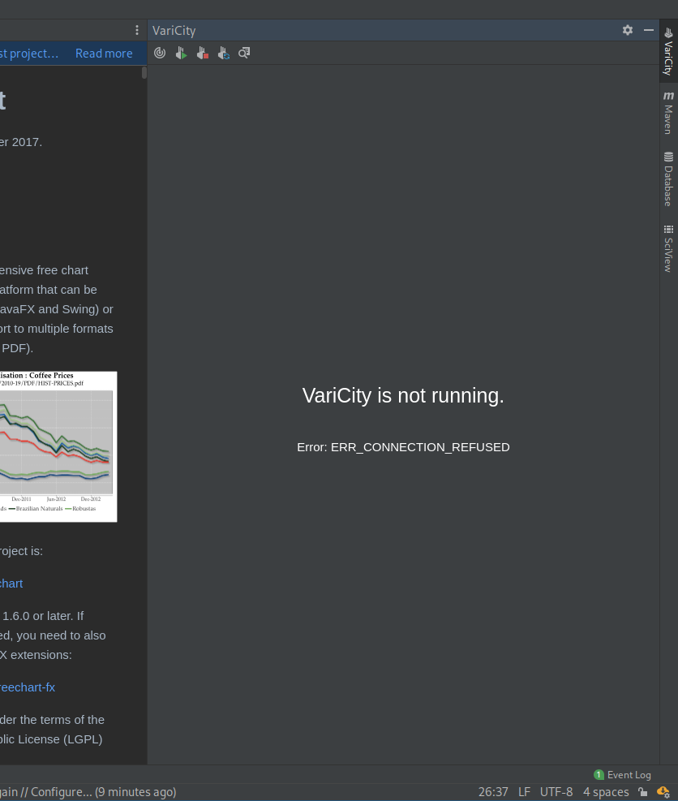

# VariCity: Visualizing Object-Oriented Variability Implementations as Cities

### Johann Mortara – Philippe Collet – Anne-Marie Dery-Pinna

This reproduction package goes with the paper "VariCity: Visualizing Object-Oriented Variability Implementations as Cities" submitted in the Special Issue on Visualization applied to Software Engineering in the Information and Software Technology Journal (IST).

## Description

The reproduction package is organized as follows:

- the `plugin-configs` directory contains both the symfinder outputs and VariCity configurations for the three projects studied in the scenarios presented in the paper (_i.e._ JFreeChart, NetBeans and Ghidra). Please note that these configuration files are in `.varicity` directories. We also provide source files for JFreeChart, but not for the two other systems, being too large.
- the `plugin-src` directory contains the source code of the JetBrains IntelliJ IDEA plugin for VariCity.
- the `prebuilt` directory contains the `varicity-plugin.zip` archive being the pre-built plugin.  
- the `varicity-src` directory contains the source code of VariCity, the city visualization presented in the paper.
  VariCity relies on data from symfinder, whose source code is also present in the same directory.
  Pre-generated source data used to generate visualizations for all 11 subject systems presented in the Table II of the paper and in the scenarios are available in the `pre_generated_visualizations.zip` archive present at the root of this directory.

```
varicity_reproduction-package
├── plugin-configs
│     ├── ghidra
|     │     └── .varicity/
│     ├── jfreechart
|     │     └── .varicity/
|     │     └── jfreechart-1.5.0.zip
│     └── netbeans
|           └── .varicity/
├── plugin-src
├── prebuilt
│     └── varicity-plugin.zip
└── varicity-src
       ├── build.bat
       ├── build.sh
       ├── experiments
       │     └── experiments.yaml
       |── ...
       ├── pre_generated_visualizations.zip
       ├── rerun.bat
       ├── rerun.sh
       ├── run.bat
       ├── run.sh
       |── ...
       └── varicity
            ├── build.bat
            ├── build.sh
            ├── config
            │     └── config.yaml
            ├── varicity.bat
            └── varicity.sh
```
In the remaining of this guide, we will refer to `varicity_reproduction-package` as the root of the project.
For example, `/varicity-src` represents the `varicity_reproduction-package/varicity-src` directory.


## Reproducing the results presented in the paper

### A. Preparing your host system

Set up your host system according to the guidelines given in the `REQUIREMENTS.md` file, and install the plugin as specified in `INSTALL.md`

### B. Using the plugin to explore a code base

#### 1. Using the plugin on a system studied in the paper

In order to use the VariCity plugin on a code base, you must have its sources.
The scenarios presented in the paper use three systems:
- [JFreeChart 1.5.0](https://github.com/jfree/jfreechart/tree/v1.5.0/)
- [NetBeans 12.2](https://github.com/apache/netbeans/tree/12.2/)
- [Ghidra 10.0.4](https://github.com/NationalSecurityAgency/ghidra/tree/Ghidra_10.0.4_build/)

We will hereafter detail the steps to make the plugin work on the JFreeChart code base, for which we provide the sources and the plugin configuration in this archive.
We also provide the plugin configurations for NetBeans and Ghidra. All are available in the `/plugin-configs/<project_name>/.varicity` directory.
The `.varicity` directory contains a JSON being the variation points and variants identified by symfinder, as well as the VariCity configuration to display the city with the paramters given in the paper.

1. Unzip the `/plugin-configs/jfreechart/jfreechart-1.5.0.zip` archive to obtain the following hierarchy:
```
/plugin-configs/jfreechart
├── jfreechart-1.5.0
|     ├── licence-LGPL.txt
|     ├── pom.xml
|     ├── README.md
|     ├── README_old.txt
|     ├── src
|     └── svg
└── .varicity
```
2. Move the `/plugin-configs/jfreechart/.varicity` directory in `/plugin-configs/jfreechart/jfreechart-1.5.0`.
```
/plugin-configs/jfreechart
└── jfreechart-1.5.0
      ├── .varicity
      ├── licence-LGPL.txt
      ├── pom.xml
      ├── README.md
      ├── README_old.txt
      ├── src
      └── svg
```
3. Open IntelliJ.
4. Navigate to `File | Open...` and select the `/plugin-configs/jfreechart/jfreechart-1.5.0` directory. The project should open and display the following project files

5. Navigate to `File | Settings` (or `IntelliJ IDEA | Preferences` on MacOs) and in the settings window navigate to the VariCity options in `Tools | VariCity | VariCity Settings`.
   The two entrypoints should be already set. In case they are not, add them manually, then apply the changes.
   
6. A VariCity button is present on the right bar of the IDE. Click on it to open the VariCity panel.
   
   
7. The  icon starts the VariCity server, and displays the city as depicted in Fig. 17a. of the paper.
   
8. The scenario presented in the paper then gives further instructions to navigate the visualization and adapt it.
   Finally, the VariCity server can be stopped by clicking on the  icon.
   

#### 2. Using the plugin on your system

In order to use the VariCity plugin on a code base, you must have its sources.

1. Open IntelliJ. 
2. Navigate to `File | Open...` and select the root of your project's sources.
3. Once the project is open and the indexation is finished, click on the VariCity button to open the VariCity panel.
   
4. Before being able to display a visualization, the symfinder toolchain must be run on the codebase.
   The  icon starts the symfinder analysis on the codebase.
   A loading bar indicates that an analysis is running.
   
5. Once the bar disappears, the analysis is finished, and a `.varicity` directory appeared at the root of the project.
   We can now start the VariCity server by clicking on the  icon, and the city is displayed.
      
6. Finally, the VariCity server can be stopped by clicking on the  icon.
   


### C. Using VariCity as a standalone visualization

#### 1. Creating the cities with VariCity using the pre-generated visualizations files

The files generated by symfinder and used by VariCity to create the cities for the 11 projects presented in the paper are available in the `pre_generated_visualizations.zip` archive.

1. Unzip the `/varicity-src/pre_generated_visualizations.zip` archive to obtain the following hierarchy (only the files useful for the reproduction are shown):
```
/varicity-src
|── ...
├── generated_visualizations
│     ├── argoUML-bcae373-composition.html
│     ├── argoUML-bcae373.html
│     ├── argoUML-bcae373.log
│     ├── awt-jb8u202-b1532-composition.html
│     ├── awt-jb8u202-b1532.html
│     ├── awt-jb8u202-b1532.log
│     ├── cucumber-v6.8.0-composition.html
│     ├── cucumber-v6.8.0.html
│     ├── cucumber-v6.8.0.log
│     ├── cxf-cxf-3.2.7-composition.html
│     ├── cxf-cxf-3.2.7.html
│     ├── cxf-cxf-3.2.7.log
│     ├── data
│     │     ├── argoUML-bcae373.json
│     │     ├── argoUML-bcae373-stats.json
│     │     ├── awt-jb8u202-b1532.json
│     │     ├── awt-jb8u202-b1532-stats.json
│     │     ├── cucumber-v6.8.0.json
│     │     ├── cucumber-v6.8.0-stats.json
│     │     ├── cxf-cxf-3.2.7.json
│     │     ├── cxf-cxf-3.2.7-stats.json
│     │     ├── ghidra-Ghidra_10.0.4_build.json
│     │     ├── ghidra-Ghidra_10.0.4_build-stats.json
│     │     ├── jfreechart-v1.5.0.json
│     │     ├── jfreechart-v1.5.0-stats.json
│     │     ├── junit-r4.12.json
│     │     ├── junit-r4.12-stats.json
│     │     ├── logbook-2.2.1.json
│     │     ├── logbook-2.2.1-stats.json
│     │     ├── maven-maven-3.6.0.json
│     │     ├── maven-maven-3.6.0-stats.json
│     │     ├── netbeans-12.2.json
│     │     ├── netbeans-12.2-stats.json
│     │     ├── riptide-2.11.0.json
│     │     └── riptide-2.11.0-stats.json
│     ├── ghidra-Ghidra_10.0.4_build-composition.html
│     ├── ghidra-Ghidra_10.0.4_build.html
│     ├── ghidra-Ghidra_10.0.4_build.log
│     ├── index.html
│     ├── jfreechart-v1.5.0-composition.html
│     ├── jfreechart-v1.5.0.html
│     ├── jfreechart-v1.5.0.log
│     ├── junit-r4.12-composition.html
│     ├── junit-r4.12.html
│     ├── junit-r4.12.log
│     ├── logbook-2.2.1-composition.html
│     ├── logbook-2.2.1.html
│     ├── logbook-2.2.1.log
│     ├── maven-maven-3.6.0-composition.html
│     ├── maven-maven-3.6.0.html
│     ├── maven-maven-3.6.0.log
│     ├── netbeans-12.1-composition.html
│     ├── netbeans-12.1.html
│     ├── netbeans-12.1.log
│     ├── riptide-2.11.0-composition.html
│     ├── riptide-2.11.0.html
│     ├── riptide-2.11.0.log
│     ├── scripts
│     ├── style.css
│     ├── symfinder-icon.png
│     └── symfinder-legend.svg
|── ...
├── varicity
     ├── build.bat
     ├── build.sh
     ├── config
     │     └── config.yaml
     ├── varicity.bat
     └── varicity.sh

```
2. Move to `/varicity-src/varicity`
3. Start VariCity (see the section "Running VariCity" of the INSTALL.md file)
4. Open your web browser and go to `http://localhost:9090`
5. On the right panel, click on `Project selection`. A list of the available projects appears.

6. By clicking on the desired project's name, the visualization appears on the left, here JFreeChart.
Please note that the visualization may not be centered when appearing. The rendering time of the visualization increases with the number of buildings to display.
To limit the loading time when switching between projects, we advise to reduce the value of the usage level to limit the number of buildings to render.

7. The entry point classes for all projects are pre-configured with the names present in Table II (in JFreeChart's case, `org.jfree.chart.JFreeChart` and `org.jfree.chart.plot.Plot`).
However, the usage orientation and usage level need to be set manually for each project.
These two settings are available on the right panel.
The usage level setting is present at the top level of the panel, whereas the usage orientation is in the `Config parameters` menu.


Changing the value of one of these parameters regenerates the visualization.

The visualization above shows JFreeChart with usage orientation set to OUT and usage level set to 2, shown in Fig. 17a of the paper.

The pre-configuration of the entry point classes for each project is done by modifying the `/varicity-src/varicity/config/config.yaml` file.
More details about the different configuration options are present in the `/varicity-src/README.md` file.

#### 2. Generating the visualizations files with symfinder

symfinder is pre-configured to be executed on the 11 systems presented in the paper.
More details about the analyzed projects and their definition are given in the "Using symfinder on your project" section in the `/varicity-src/README.md` file.

To generate the visualizations files, go to the `/varicity-src` and run symfinder as detailed in the "Running symfinder" section of the `INSTALL.md` file.

*Note:* Analyzing the 11 projects with symfinder can be time consuming, especially for CXF, NetBeans and Ghidra which can require multiple hours of computation depending on your host system.
To obtain minimum but viable results for reproduction in a reasonable amount of time, we thus advise to analyze only small projects, like JFreeChart for example.


## Reusing VariCity and symfinder on other projects

Instructions to adapt symfinder and VariCity for your project are detailed in the sections "Using symfinder on your project" and "Configure VariCity for your project" in the `/varicity-src/README.md` file.
