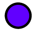
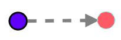

# Légende actualisée du graphe

## Classe
* **Sans surcharge de méthodes et/ou constructeurs**

    

* **Avec surcharge de méthodes**

    

PS: La taille du noeud varie en fonction du nombre de méthodes surchargées. 

* **Avec surcharge de constructeurs**

    

* **Avec un nombre de variantes**

    

* **Abstraite et non publique**

    

* **Abstraite et publique**

    

* **Publique avec un nombre faible de méthodes publiques et un faible pourcentage de méthodes publiques dans la classe**

    

* **Publique avec un nombre élevé de méthodes publiques et un pourcentage élevé de méthodes publiques dans la classe**

    

    

PS: La visibilité publique s'illustre par la couleur Turquoise qui garde sa saturation de base lorsque le pourcentage de méthodes publiques dans la classe est faible.
Mais qusnd ce pourcentage est élevé, la saturation passe de la turquoise au vert.
Plus ce pourcentage est élevé, plus le vert devient foncé et ceci, quelque soit la nature de la classe ou même d'une interface (Abstract, ...), du moment qu'elle est publique et contient des méthodes publiques. 

## Point de variation
* **Non publique**

    

* **Publique**

    

## Interface
* **Non publique**

    

* **Publique**

    

       
## Pattern
* **Stratey**

    

* **Factory**

    

## Héritage
* **Symbole**

    

PS: La classe représentée par le noeud rouge foncé hérite la classe représentée par le noeud rouge clair.

## Composition
* **Symbole**

    

PS: La classe représentée par le noeud bleu utilise la classe représentée par le noeud rouge. 